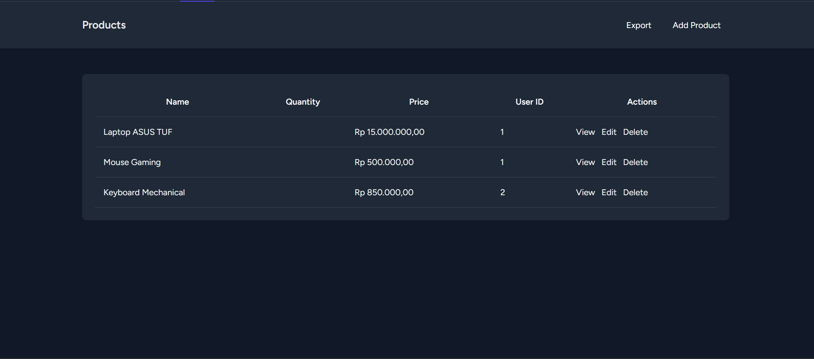
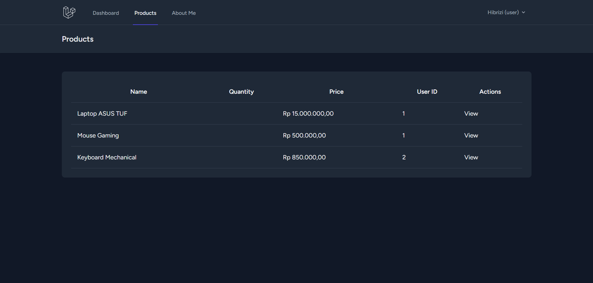
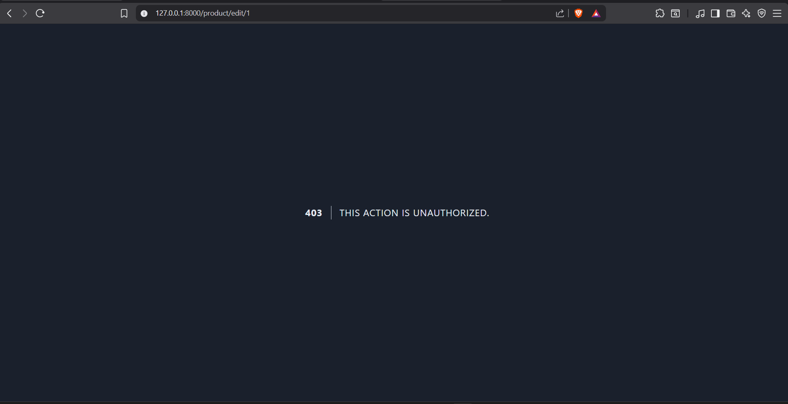

Screenshot Role Admin
__________________________________________________________________________________________
Pada tampilan Admin, di Navigation Bar di kanan atas sudah menunjukkan nama Admin dengan label "(Admin)" yang menunjukkan role pengguna saat ini yaitu Admin. Admin bisa melihat tombol edit/hapus pada semua produk. Terdapat tombol export di tampilan Admin.

Screenshot Role User
______________________________________________________________________________________________
Pada tampilan User, di Navigation Bar di kanan atas sudah menunjukkan nama User dengan label "(User)" yang menunjukkan role pengguna saat ini yaitu User. User juga hanya bisa melihat tombol edit/hapus pada produk buatannya sendiri. Tidak ada tombol export di tampilan User.

Screenshot Bukti Policy
______________________________________________________________________________________________
Saat login sebagai User, jika mencoba merubah produk orang lain lewat URL akan muncul halaman "403 THIS ACTION IS UNAUTHORIZED."

